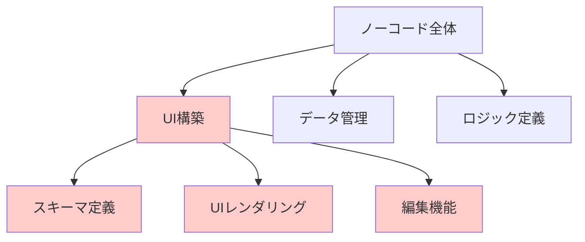

# Valibot Schema Driven UI ノーコード Web サイトビルダーを実装してみよう！

TSKaigi 2025 - 2025/05/24

  <button class="text-xl slidev-icon-btn opacity-50 !border-none !hover:text-white">
    @MH4GF <carbon:logo-github />
  </button>

---

# 自己紹介

- 宮城広隆 / @MH4GF
- ROUTE06, inc.
- 好きなもの: GraphQL, GitHub Actions, 静的解析
- 最近の活動: Liam ERD (OSS ER 図自動生成ツール) を開発中

---

layout: center
class: text-center

---

# ノーコードプラットフォームとは

<v-clicks>

- プログラミングの知識がなくてもアプリケーションを構築できるツール
- 代表例: Bubble、Webflow、STUDIO など
- よくある機能
  - ドラッグ&ドロップでパーツを選び、視覚的に UI を構築
  - ビジュアルエディタでスタイル（色・サイズ・配置）を直感的に調整
  - ワンクリックでデプロイ・公開が可能

</v-clicks>

<!--
ノーコードプラットフォームは、コーディングなしでアプリを作れる画期的なツールです。例えばWebflowなら、普段HTMLやCSSを書いたことがない方でも美しいWebサイトが作れます。

よくある機能を見ていきましょう。まず基本となるのがドラッグ&ドロップのUIです。ボタンやテキスト入力欄などの部品をマウス操作だけで配置できるため、HTMLやCSSを書く必要がありません。

次に、配置した要素のスタイル調整も視覚的に行えます。色やサイズ、配置などをスライダーやカラーピッカーで直感的に設定でき、CSSプロパティの知識がなくても美しいデザインが可能です。

そして完成したら、複雑なデプロイ設定なしにワンクリックで公開できるのも大きな特徴です。
-->

---

# どうやって実現されている？

<v-clicks>

- UI パーツのドラッグ&ドロップが、どのように HTML や CSS に変換されるのか？
- ビジュアルエディタでの変更を、どうやってリアルタイムでプレビューに反映しているのか？
- 多様なスタイリングやレイアウトの組み合わせを、どう効率的に管理しているのか？

</v-clicks>

<!--
これからノーコードプラットフォームの技術的な側面について考えていきましょう。

まず、ドラッグ&ドロップ操作をコードに変換する仕組みはどうなっているでしょうか？
視覚的な操作がどのようにHTMLやCSSに変わるのか、考えたことはありますか？

次に、エディタで色やサイズを変更したとき、その変更がすぐに反映される仕組みは？
リアルタイムでの更新を実現するためには、何が必要でしょうか？

そして、多様なデザインの組み合わせをどう管理しているのでしょう？
無限とも言える組み合わせを効率的に扱うための工夫とは？

こうした疑問に対する解決策が、実はWeb開発全般でも応用できるヒントになります。
-->

---

# 本発表の概要とゴール

<v-clicks>

## 概要

- ノーコードビルダーの UI 構築部分に焦点を当てた実装パターンの紹介
- **Valibot** と **TypeScript** を活用した型安全なアプローチ
- スキーマ駆動による拡張性の高い UI コンポーネント設計

## ゴール

**動的 UI 構築機能の型安全な実装パターンを理解し、日々の開発に活かせるようになる**

</v-clicks>

<!--
今日の発表では、ノーコードプラットフォームのUI構築機能に焦点を当て、その実装パターンを紹介します。

特に、ValibotというTypeScript向けスキーマバリデーションライブラリを使った型安全な実装方法に注目します。これは単にノーコードビルダーだけでなく、動的なUIを扱うあらゆるケースで応用できる設計パターンです。

例えば、ユーザー権限によって表示内容が変わるダッシュボード、設定に応じて形が変わるフォーム、カスタマイズ可能なレポート画面など、皆さんの日常開発でも「動的に変わるUI」は頻繁に登場すると思います。

今日お話しする型安全なスキーマ駆動アプローチを学ぶことで、そうした動的UIを柔軟かつ安全に実装するヒントを持ち帰っていただけると思います。

図に示すように、ノーコードプラットフォームには様々な機能がありますが、今回は赤色で示したUI構築部分を深掘りしていきます。
-->

---

# アジェンダ

<v-clicks>

1. **デモ**
2. **Valibot Schema Driven UI の基本概念**
3. **スキーマ定義とアーキテクチャ**
4. **実装パターン**
5. **拡張パターン**
6. **まとめ**

</v-clicks>

<!--
これから進めていく内容の全体像をご説明します。

まずはデモを通じて、実際に何を作るのかを具体的にイメージしていただきます。ノーコードビルダーの基本的な動作や機能を確認しましょう。

次に、このアプローチの基本となる「Valibot Schema Driven UI」の概念について説明します。TypeScriptとの親和性が高いValibotの特徴や、スキーマ駆動開発のメリットについてお話しします。

続いて、スキーマ定義とアーキテクチャについて掘り下げます。どのようにコンポーネント構造を設計し、型安全性を担保するかを見ていきます。

実装パターンでは、実際のコードレベルで、スキーマからUIコンポーネントへの変換方法や、エディタの実装手法を紹介します。

さらに発展的な内容として、スタイリングの実装やLLMを活用したText-to-UI機能など、拡張パターンもご紹介します。

最後に、今回学んだ内容を日常の開発にどう活かせるかをまとめます。

基礎から応用へと順を追って進めていきますので、ぜひ最後までお付き合いください。
-->

---

# デモ

- ソースコード: https://github.com/MH4GF/valibot-schema-driven-ui

<!--
今回実装するノーコードWebサイトビルダーのデモをお見せします。

左ペインでブロックを追加・編集・削除し、結果のプレビューがリアルタイムで右ペインに表示されるようなビジュアルエディタを実装しています。

ヘッダーにはプレビュー画面への導線があり、プレビュー画面ではユーザーが作成したアプリケーションだけを閲覧することができます。

この機能を実現するためには、UIコンポーネントをスキーマで表現し、そのスキーマを編集できるインターフェースと、スキーマからUIを生成する仕組みが必要になります。

これからの発表では、この機能を型安全に実装する方法について、詳しく説明していきます。実際のコードを見ながら、スキーマ駆動UIの考え方を理解していきましょう。

なお、これから紹介するコード例では、エディタのスタイリングに関するコードは除外し、本質的なロジックに焦点を当てて説明します。実際のソースコードはGitHubで公開していますので、よろしければ参照してください。
-->

---

1. **デモ**
2. **Valibot Schema Driven UI の基本概念**
3. **スキーマ定義とアーキテクチャ**
4. **実装パターン**
5. **拡張パターン**
6. **まとめ**

---

